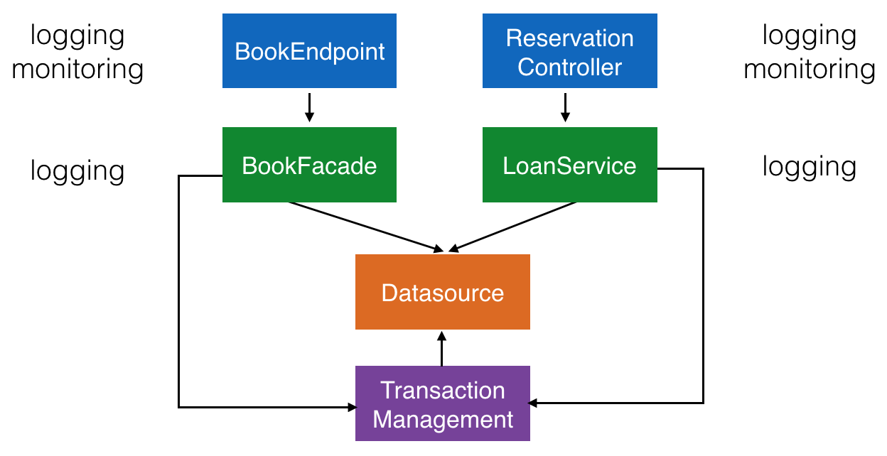
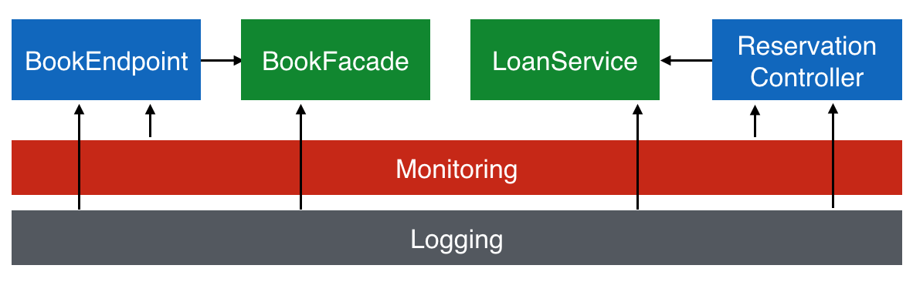

# AOP Demo in Java

A demo showing aspect oriented programming in Java without third party frameworks like Spring AOP.

## Before

This example shows a simple library (data model inaccurate) with a REST endpoint for books and a JSF website to create a new reservation. The problem is that there are functionalities spread across different classes (logging is implemented in every service). 

## Goal

## Interceptors

- `at.htl.aopdemo.interceptor.LoggingInterceptor`
- `at.htl.aopdemo.interceptor.MonitoringInterceptor`

## Decorators

- `at.htl.aopdemo.decorators.UmlautLoanService`
